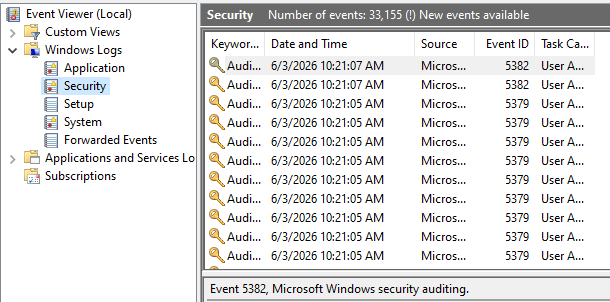
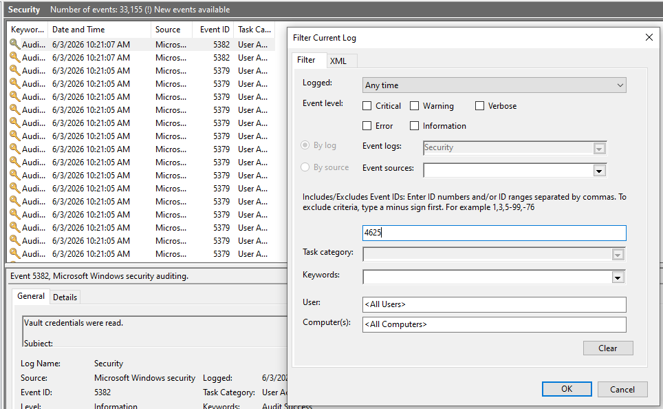
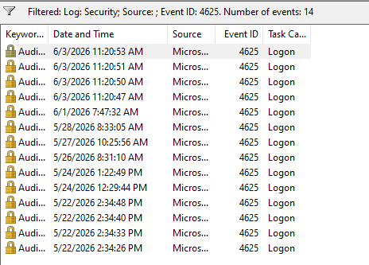
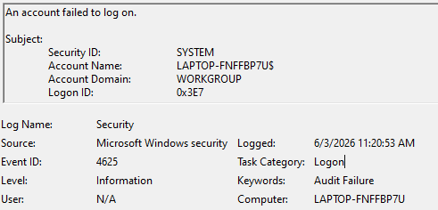

# Windows Failed Login Investigation

## Introduction

This project demonstrates the investigation of failed Windows authentication attempts using Event Viewer and Security Event ID 4625.

The objective of the lab was to analyze failed logon events, identify the reason for authentication failures, investigate account activity, and understand how security analysts use Windows logs to detect suspicious behavior.

The investigation was performed using native Windows logging capabilities and focused on Event ID 4625.

## Lab Environment

* Windows 10
* Event Viewer
* Windows Security Logs

## Investigation Objectives

* Identify failed logon attempts
* Analyze Windows Security Event ID 4625
* Investigate authentication failures
* Determine logon type and failure reasons
* Understand SOC investigation workflows

## 1. Windows Security Log Overview

The investigation began by accessing the Windows Security log through Event Viewer.

The Security log contains authentication events, account activity, privilege changes, and other security-related records generated by the operating system.

Security analysts frequently use this log as a primary source of evidence during incident investigations and authentication monitoring activities.

## 2. Filtering Security Events

To focus the investigation on failed authentication activity, the Security log was filtered using Event ID 4625.

Filtering logs is a common practice during SOC investigations because it allows analysts to isolate relevant events from thousands of system records.

Event ID 4625 specifically represents a failed logon attempt and is commonly monitored to identify authentication issues, unauthorized access attempts, and potential brute-force activity.

## 3. Failed Logon Events Identified

After applying the filter, multiple Event ID 4625 entries were identified within the Security log.

These events represent authentication failures recorded by the Windows operating system.

Reviewing failed logon events allows security analysts to determine patterns of authentication activity, identify recurring failures, and investigate potential security concerns affecting user accounts and systems.

The presence of multiple failed logon events provided the evidence required to begin a detailed authentication investigation.

## 4. Event ID 4625 Investigation

A detailed review of Event ID 4625 was performed to identify the circumstances surrounding the failed authentication attempt.

The event details provide valuable information including the affected account, logon type, failure reason, status codes, and additional authentication data.

Analyzing individual security events is a fundamental task performed by SOC analysts during incident investigations and authentication monitoring activities.

The event data serves as evidence that helps determine whether an authentication failure is the result of normal user behavior, configuration issues, or potentially suspicious activity.

